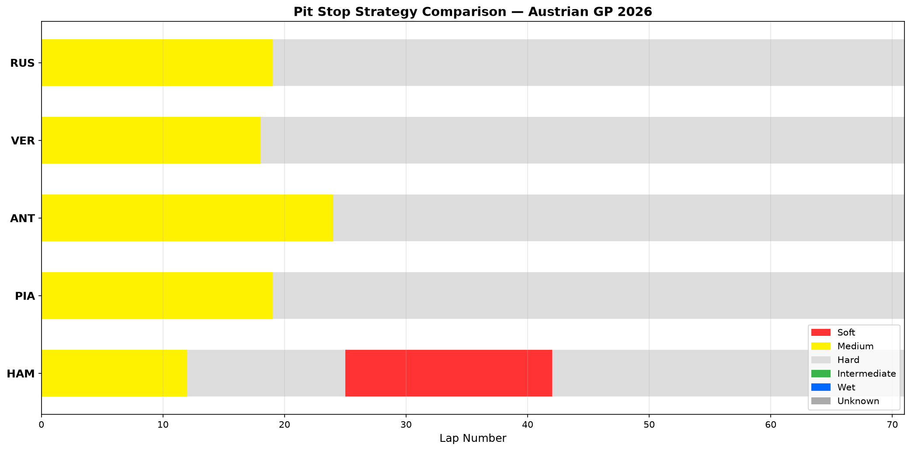

# F1 Pit Stop Strategy Comparator

A Python tool that visualises and compares the pit stop strategies of the top 5 finishers in a Formula 1 Grand Prix using real race data from the FastF1 API.

## What it does

This script generates a horizontal bar chart showing each driver's tyre compound usage across every lap of the race. It allows instant visual comparison of:

- When each driver made their pit stops
- Which tyre compounds were used in each stint
- How different strategies played out across the race distance
- Who ran longer or shorter stints and why

## Example Output

This example compares Russell, Verstappen, Antonelli, Piastri and Hamilton at the 2026 Austrian Grand Prix. Hamilton's strategy stands out clearly — a short Medium opening stint followed by an aggressive Soft tyre second stint, contrasting with the Medium-focused strategies of the other top finishers.

## Tech Stack

- Python
- [FastF1](https://github.com/theOehrly/Fast-F1) — official F1 timing and telemetry data
- Matplotlib — data visualisation
- Pandas — data handling

## How to Run

1. Install dependencies: `pip install fastf1 matplotlib pandas`
2. Run the script: `python pit_stop_strategy.py`
3. The chart will display and save automatically as `pit_stop_strategy.png`

## Why This Project

Pit stop strategy is one of the most critical and complex decisions in motorsport. This tool helps visualise and compare strategic choices in real races, building the analytical foundation needed for a career in race strategy engineering.

## Author

Hamna Shahzad — BS Electrical Engineering Student
